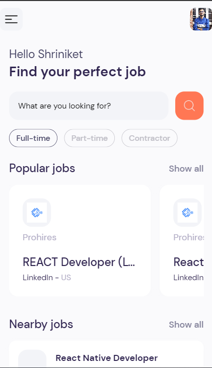
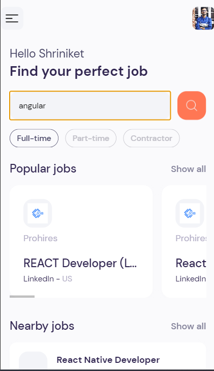
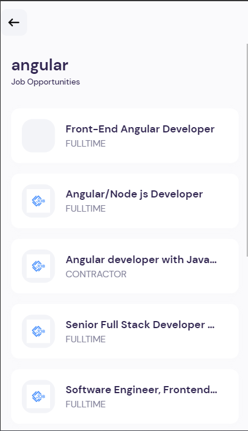

# Job Search App

Welcome to the Job Search App! This React Native application allows users to search for the latest job postings from various sources using Rapid API. Users can explore job listings, view job details including qualifications and responsibilities, and apply for jobs seamlessly. Built with React Native and Expo, this app provides a smooth user experience with Expo router for easy navigation.

## Features

- **Latest Job Listings**: Access the latest job postings from various sources.
- **Detailed Job Information**: View job details including qualifications and responsibilities.
- **Search Functionality**: Search for jobs by keywords such as tech stacks (e.g., Angular, React).
- **Seamless Job Application**: Apply for jobs directly within the app and get redirected to the actual job posting on external websites like LinkedIn.

## Screenshots

_Explore and search for jobs by keywords._

_View detailed information about job listings._

## Technologies Used

- React Native
- Expo
- Expo router
- Rapid API

## Installation

1. Clone the repository.
2. Navigate to the project directory.
3. Run `npm install` to install dependencies.
4. Run `expo start` to start the development server.
5. Scan the QR code with Expo Go app to run the app on your device.

## Getting Started

To get started with the Job Search App, follow these steps:

1. Launch the app on your device.
2. Use the search functionality to find jobs based on your preferences.
3. Click on a job listing to view detailed information.
4. Apply for jobs seamlessly within the app.
5. Get redirected to the actual job posting on external websites to complete your application.

## Contributors

- [Shriniket Kulkarni](https://github.com/Shriniket007)
-

## License

This project is licensed under the MIT License - see the [LICENSE](LICENSE) file for details.
